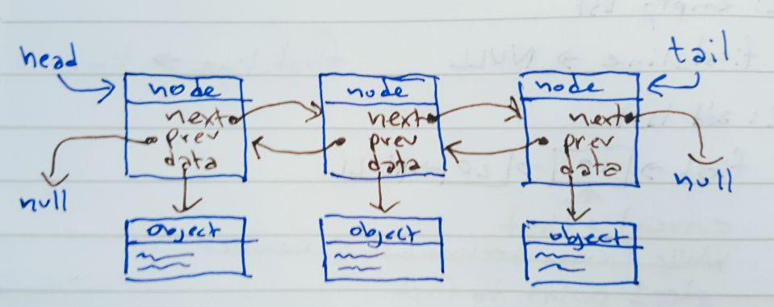

# Doubly Linked List

The Doubly Linked List is an implementation of a dynamic list, which uses an underlying collection of **nodes** where each one "links" or "points" both to the next one *and* the previous one. Just like the [Singly Linked List](../singlylinkedlist/) it can grow or shrink indefinitely, and is even quicker at inserting and removing nodes, since most operations only require two or three sets of **next** and **prev** pointers to be removed.

The list itself contains two pointers: **head** to the first **node** in the list, and **tail** to the last **node**. In an empty list, both pointers point to null, in a list with a single element, both pointers point to that element.

Each node in the list points _forward_ to the **next** node, or to `null` if it is the last in the list - as well as _backward_ to the **previous** node, or to `null` if it is the first in the list. And in addition each node points to a **data object**, the actual contents of the list!



Normally, a linked list hides **nodes** and **links** and only publish **data**, so in principle it is impossible to tell the difference between a linked list and a dynamic array - but this version also has methods to receive and return nodes directly.

# Usage

# Reference

The list is implemented as a class called `DoublyLinkedList`, that can be imported by other modules.

* Properties    
  The list has these properties that are accessible from the outside
  - `head` - refers to the first node in the list
  - `tail` - refers to the last node in the list
* Constructor
  - `new SinglyLinkedList()` - doesn't receive anything, just initializes an empty list
* Basic list methods - they receive and return all `data objects`, thus hiding nodes from the user.
    - `addLast( data )` - adds an element to the end of the list
    - `addFirst( data )` - adds an item to the beginning of the list
    - `get( index )` - returns data at that index
    - `getFirst()` - returns data for the first node in the list
    - `getLast()` - returns data for the last node in the list (furthest away from head)
    - `set( index, data )` - finds the node at that index and replaces its data pointer.
    - `size()` - returns the number of nodes in the list
* Dynamic List methods - that modify the list, but still hide nodes from the user
    - `insert( index, data )` - creates a new node and inserts it at that index - before the one that was already there.
    - `insertAfter( index, data )` - inserts a new element after the space number *index*
    - `insertBefore( index, data )` - inserts a new element before slot number *index*
    - `remove( index )` - finds the node at that index, removes it, and returns its data
    - `removeFirst()` - removes the first node in the list and returns its data
    - `removeLast()` - removes the last node in the list and returns its data
    - `clear()` - removes all nodes so that the list is empty
* Internal methods that expose `node objects` to the outside      
    - `printList()` - which prints the entire linked list to the console, including data and pointers
    - `getNode( index )` - finds and returns the node at that index
    - `getFirstNode()` - returns the first node in the list
    - `getLastNode()` - returns the last node in the list
    - `getNextNode( node )` - returns the node immediately after the one received (or `null` if it was the last)
    - `getPreviousNode( node )` - returns the node before the received one (or `null` if it was the first)
    - `insertBeforeNode( node, data )` - creates a new node with a link to the data object and inserts it into the list *before* the existing node.
    - `insertAfterNode( node, data )` - creates a new node with a link to the data object and inserts it into the list *after* the existing node.
    - `makeLast( node )` - moves that node to the end of the list
    - `makeFirst( node )` - moves that node to the beginning of the list
    - `removeNode( node )` - removes that node from the list
    - `swap( nodeA, nodeB )` - swaps the two nodes' places in the list.


## Test

Run the tests defined in `test.js` with mocha, by writing
```bash
  npx mocha
```
when in the current folder (`doublylinkedlist`)