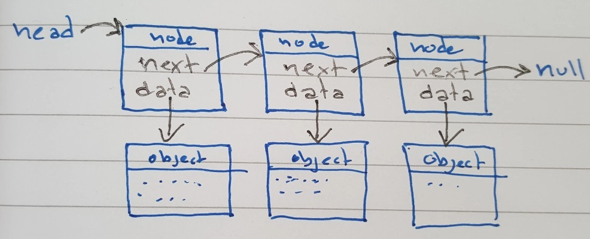

# Singly Linked List

The Singly Linked List is an implementation of a dynamic list, which uses an underlying collection of **nodes**, where each one "links" or "points" to the next one. It can grow or shrink indefinetely, since all it has to do, is link or unlink a node from anywhere in memory into the list. 

The list itself contains only a pointer **head** that points to the first **node** in the list.
Each **node** then points to the next **node** and to a **data object**. So, for example, if you want to use the class for a list of enemy objects in a game, each **node**'s **data** object can be such an enemy object.
The last **node** in the list points to `null`.



Normally, a LinkedList abstracts all these nodes away from prying eyes and keeps them internal, but because we are also interested in how the list is implemented, this version also has methods to receive and return nodes directly. 

## Usage

*Note: All these examples are supposed to be combined into one program in the order shown to give the suggested results.*

Create a new linked list by calling the constructor

```js
  const list = new SinglyLinkedList();
``` 

Add elements to the list as many times as you want:
```js
  list.add("C");
  list.add("A");
  list.add("T");
```

Retrieve the elements with either of the get-methods:
```js
  list.getFirst();  // will return "C"
  list.get(1);      // will return "A"
  list.getLast();   // will return "T"
```

Modify the data at a certain position
```js
  list.set(2, "R"); // changes the list from C->A->T to C->A->R
```

Because the list is dynamic, you can also insert additional elements in between others - the index given is the place where the new element should be inserted, whatever was at that index, is shifted "up" the list, as is everything following it.
```js
  list.insert(2, "E"); // changes the list to C->A->E->R
  list.insert(3, "S"); // changes it further to C->A->E->S->R
```

You can also remove the first, the last, or any index of the list
```js
  list.removeLast(); // changes the list to C->A->E->S
  list.remove(2);    // removes the element at index 2
                     // changing the list to C->A->S
```

You can see the current number of elements with `size`
```js
  console.log( list.size() ); // the list contains '3' elements
```

Everything can be removed at once with the `clear` method:
```js
  list.clear();     // empties the list completely
```


### internals

You can always "peek inside" the list, with the `printList()` method. Calling it on this list:

```js
  list.add("C");
  list.add("A");
  list.add("T");

  list.printList();
```

Prints a list somewhat like:

 ```bash
 > C->A->T
 ```
depending on the exact, where each `data`-element is written with an arrow `->` to the next one.

Every **node** is implemented as an object with a pointer to the **data** as well as to the **next** node, and there is a number of methods that expose these nodes, and allows you to inspect them directly.

You can get a node, just like getting data:

```js
  list.getFirstNode();  // returns the node { data: "C", next: node with A }
  list.getNode(1);    // returns the node { data: "A", next: node with T }
  list.getLastNode();   // returns the node { data: "T", next: null }
```  

And when you have a node, you can get those around it:
```js
  const node = list.getNode(1); // sets node to the one with { data: "A", next: node with T }
  list.getNextNode(node);     // returns the node { data: "T", next: null }
  list.getPreviousNode(node); // returns the node { data: "C", next: node }
```

You can also insert new data next to an existing node
```js
  // node is still { data: "A", next: node with T }
  list.insertBefore(node, "R") // changes the list to C->R->A->T
  list.insertAfter(node, "E") // changes the list to C->R->A->E->T
```

And you can remove an existing node
```js
  list.removeNode(node) // changes the list to C->R->T
```

You can of course use the `getNode` methods as input to the other methods, like e.g.
```js
  const anode = list.getLastNode();
  list.insertBefore(anode, "U");  // changes the list to C->R->U->T
  list.insertAfter(list.getFirstNode(), "E") // changes the list to C->E->R->U->T
  // and so on ...
```


## Reference

- Constructor 
  - `new SinglyLinkedList()` - doesn't receive anything, just initializes an empty list
- Basic list methods - they receive and return all `data objects`, thus hiding nodes from the user.
    - `add( data )` - creates a new node with a link to the data object and adds it to the list
    - `get( index )` - returns data at that index
    - `getFirst()` - returns data for the first node in the list
    - `getLast()` - returns data for the last node in the list (furthest away from head)
    - `set( index, data )` - finds the node at that index and replaces its data pointer.
    - `size()` - returns the number of nodes in the list
- Dynamic List methods - that modify the list, but still hide nodes from the user
  - `insert( index, data )` - creates a new node and inserts it at that index - before the one that was already there.
  - `remove( index )` - finds the node on that index, removes it, and returns its data
  - `removeFirst()` - removes the first node in the list and returns its data
  - `removeLast()` - removes the last node in the list and returns its data
  - `clear()` - removes all nodes so that the list is empty
- Internal methods that expose `node objects` to the outside
    - `printList()` - prints the entire linked list to the console, including data and pointers
    - `getNode( index )` - finds and returns the node at that index
    - `getFirstNode()` - returns the first node in the list
    - `getLastNode()` - returns the last node in the list
    - `getNextNode( node )` - returns the node immediately after the one received (or `null` if it was the last)
    - `getPreviousNode( node )` - returns the node before the received one (or `null` if it was the first)
    - `insertBefore( node, data )` - creates a new node with a link to the data object and inserts it into the list *before* the existing node.
    - `insertAfter( node, data )` - creates a new node with a link to the data object and inserts it into the list *after* the existing node.
    - `removeNode( node )` - removes the node from the list
    


## Test

Run the tests defined in `test.js` with mocha, by writing
```bash
  npx mocha
```
when in the current folder (`singlylinkedlist`)

